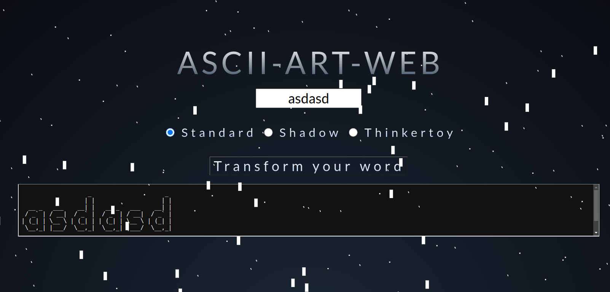
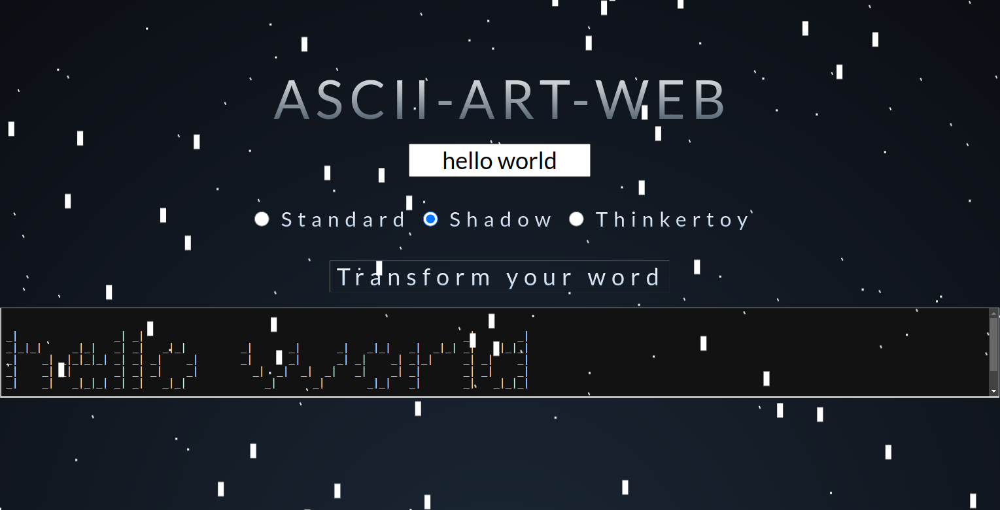

# ascii-art-generator

## Table of Contents
- [ascii-art-generator](#ascii-art-generator)
  - [Table of Contents](#table-of-contents)
  - [General Information](#general-information)
  - [Features](#features)
  - [Technologies Used](#technologies-used)
  - [Team \& My Work](#team--my-work)
  - [Main Learnings](#main-learnings)
  - [Setup](#setup)
  - [Images](#images)


## General Information
This project was made as a school project in [kood/Jõhvi](https://kood.tech/) (10.06.2021). 

The project required us to create a webpage which could transform user input into 3 different predefined ascii art fonts. 

The second task was to dockerize the web application.

  **NB! Different source control platform was used hence no commit history.**

## Features
- Transform your text into amazing ascii art font.

## Technologies Used

[Golang](https://go.dev/)
  
[Docker](https://www.docker.com/)

## Team & My Work
In this project I was in a team with another student from kood/Jõhvi.

I was responsible for designing the frontend and dockerizing the application.


## Main Learnings
- Basics of web applications
- Basics of HTTP protocols
- Basics of HTML & CSS
- Basics of Docker
- Utilziing bash to automate build process

## Setup
Clone the repository
```
git clone https://github.com/JesusKris/ascii-art-generator.git
```
Run the server
```
go run server.go
```
## Images

